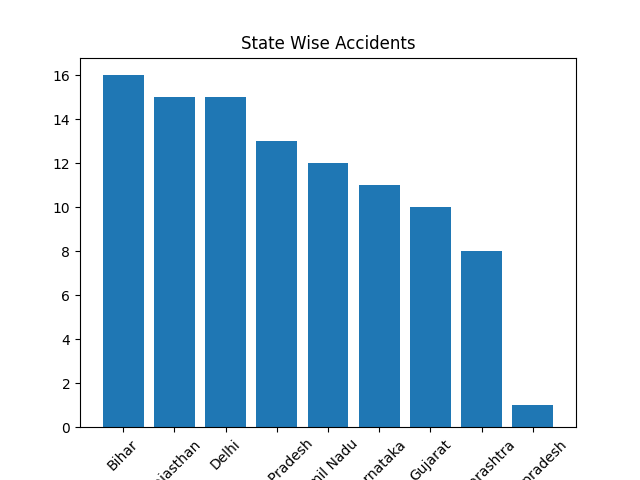
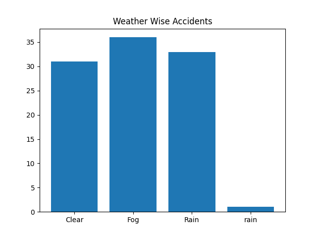
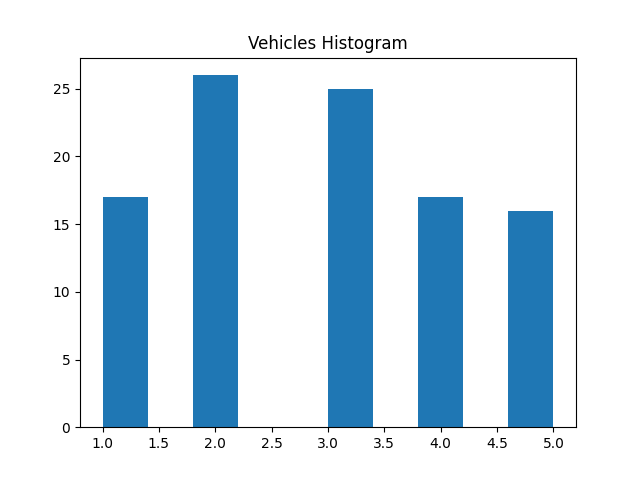

# 🚦 Accident Analysis in India Project

## 📌 Project Description
This project analyzes road accident data in India using Python, Pandas, SQL and Matplotlib.

The goal of this project is to find accident patterns based on state, weather, severity, time and vehicles involved.

## 🛠 Tools Used
- Python
- Pandas
- SQLite / SQL
- Matplotlib
- VS Code
- GitHub

## 📊 Analysis Done
- Total accidents count
- State wise accident analysis
- Severity analysis (Minor / Major / Fatal)
- Weather condition analysis
- Road type analysis
- Time based analysis
- Vehicles involved analysis

## 📈 Output Graphs

## 📂 Dataset
Sample dataset used for learning purpose.

## 🚀 Future Improvement
- Power BI Dashboard
- Machine Learning prediction
- Interactive charts

## 👩‍💻 Author
Swati Singh
B.Tech CSE Student